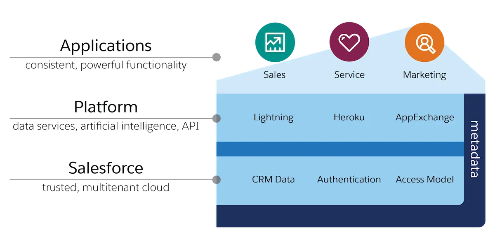

 
+Salesforce is a cloud company. Everything we offer resides in the trusted, multitenant cloud. 
+The Salesforce platform is the foundation of our services.  
+It’s powered by metadata and made up of different parts, like data services, artificial intelligence, and robust APIs for development. 
+All our apps sit on top of the platform. Our prebuilt offerings like Sales Cloud and Marketing Cloud Engagement, along with apps you build using the platform, have consistent, powerful functionality. 
+Everything is integrated. Our platform technologies like predictive analytics and the development framework are built into everything we offer and everything you build. 