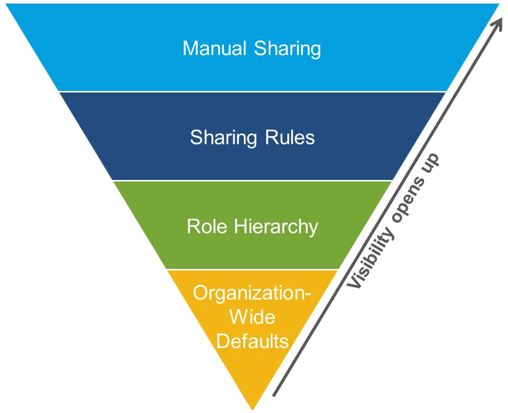
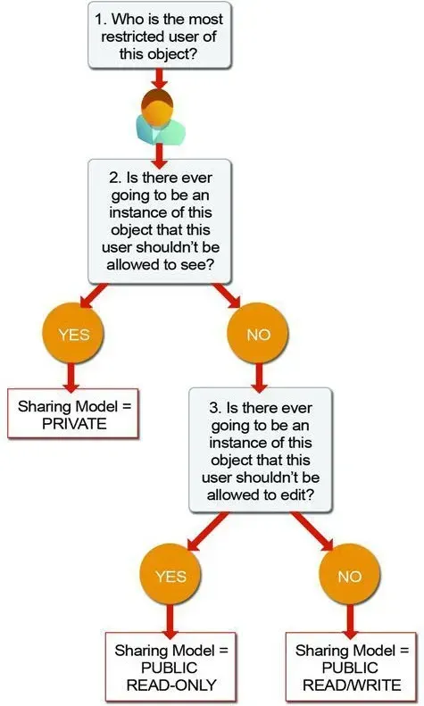

# Introduction
- Salesforce includes simple-to-configure security controls that make it easy to specify which users can *view, create, edit, or delete* any record or field in the app. 
- You can configure access at the level of the organization, objects, fields, or individual records. 
- By combining security controls at different levels, you can provide just the right level of data access to thousands of users without having to specify permissions for each user individually.
- This is basically controlling what your users can access in **User Management Part**.

# Levels of Data Access

You can configure access to data in Salesforce at *four* main levels. 

1. **Organization** 

    At the highest level, you can secure access to your organization by maintaining a list of authorized *users, setting password policies, and limiting login access to certain hours and certain locations*.

2. **Objects** 
- Object-level security provides the simplest way to control which users have access to which data. By setting permissions on a particular type of object, you can prevent a group of users from creating, viewing, editing, or deleting any records of that object. 
- For example, you can use object permissions to ensure interviewers can view positions and job applications but not edit or delete them. 
**- We recommend you use permission sets and permission set groups to configure object permissions**.

3. **Fields** 
- Field-level security restricts access to certain fields, even for objects a user has access to. 
- For example, you can make the salary field in a position object invisible to interviewers but visible to hiring managers and recruiters. 
- Field permissions are also configured in permission sets.

4. **Records** 
- To control data with greater precision, you can allow particular users to view an object, but then restrict the individual object records they're allowed to see. 
- For example, record-level access allows interviewers to see and edit their own reviews, without exposing the reviews of other interviewers. 
- You set the default level of access that users have to each others’ records using **organization-wide defaults**. 
- To control data access precisely, you can allow particular users to view specific fields in a specific object, but then restrict the individual records they're allowed to see.
- Record access determines which individual records users can view and edit in each object they have access to in their profile. First ask yourself these questions:
- Should your users have open access to every record, or just a subset?
- If it’s a subset, what rules should determine whether the user can access them?
- Consequence of two important concepts:

- The permissions on a record are always evaluated according to a combination of object-level, field-level, and record-level permissions.
- When object-level permissions conflict with record-level permissions, the most restrictive settings win.
- Then, you can use the *role hierarchy, sharing rules, manual sharing, and other sharing features* to open up access to records. 
1. **Organization-wide defaults** specify the default level of access users have to each others’ records. You use org-wide sharing settings to lock down your data to the most restrictive level, and then use the other record-level security and sharing tools to selectively give access to other users.(Explained Further briefly)

2. **Role hierarchies** give access for users higher in the hierarchy to all records owned by users below them in the hierarchy. Role hierarchies don’t have to match your organization chart exactly. Instead, each role in the hierarchy should represent a level of data access that a user or group of users needs.

- A role hierarchy works together with sharing settings to determine the levels of access users have to your Salesforce data. Users can access the data of all the users directly below them in the hierarchy.
- Users who need to see a lot of data (such as the CEO, executives, or other management) often appear near the top of the hierarchy. But role hierarchies don't have to match your org chart. Each role in the hierarchy just represents a level of data access that a user or group of users needs.
- Users always have access to data owned by or shared with their subordinates in the role hierarchy, regardless of the org-wide default settings. The only exception is for custom objects, for which you can disable access using hierarchies.
- Users who tend to need access to the same types of records can be grouped together. We'll use these groups later when we talk about sharing rules.
- Depending on your sharing settings, roles can control the level of visibility that users have into your Salesforce data. Users at any given role level can view, edit, and report on all data owned by or shared with users below them in the role hierarchy, unless your sharing model for an object specifies otherwise. Specifically, in the Organization-Wide Defaults related list, if the Grant Access Using Hierarchies option is disabled for a custom object, only the record owner and users granted access by the org-wide defaults receive access to the object's records.
- Beyond setting the org-wide sharing defaults for each object, you can specify whether users have access to the data owned by or shared with their subordinates in the hierarchy. For example, the role hierarchy automatically grants record access to users above the record owner in the hierarchy. By default, the Grant Access Using Hierarchies option is enabled for all objects. It can only be changed for custom objects.

3. **Sharing rules** are automatic exceptions to organization-wide defaults for particular groups of users, so they can get to records they don’t own or can’t normally see. Sharing rules, like role hierarchies, are only used to give additional users access to records. They can’t be stricter than your organization-wide default settings.

4. **Manual sharing** allows owners of particular records to share them with other users. Although manual sharing isn’t automated like org-wide sharing settings, role hierarchies, or sharing rules, it can be useful in some situations, such as when a recruiter going on vacation needs to temporarily assign ownership of a job application to someone else.

- The visibility and access for any type of data is determined by the interaction of the above security controls, based on these key principles.
- A user’s baseline permissions on any object are determined by their profile.
- If the user has any permission sets assigned, these also set the baseline permissions in conjunction with the profile.
- Access to records a user does not own are set first by the org-wide defaults.
- If the org-wide defaults are anything less than Public Read/Write, you can open access back up for certain roles using the role hierarchy.
- You can use sharing rules to expand access to additional groups of users.
- Each record owner can manually share individual records with other users by using the Share button on the record.

Let’s take a closer look at two features used to configure data access: **permission sets and organization-wide defaults**.

**Permission Sets** 
- Permission sets are collections of settings and permissions that determine what users can do in Salesforce. 
- Use permission sets to grant access to objects, fields, tabs, and other features and extend users’ access without changing their profiles.

*What’s so great about permission sets?* Because you can reuse smaller permission set building blocks, you can avoid creating dozens or even hundreds of profiles for each user and job function. That’s why we recommend you assign users the *Minimum Access - Salesforce profiles*, and then use permission sets and permission set groups to manage your users’ access.
*When you create permission sets, include all permissions necessary for a job or task*.

**Permission Set Groups - groups of permission sets**
- Use permission set groups to bundle permission sets together based on a job persona or role. 
- A permission set is a collection of settings and permissions that give users access to various tools and functions.
- You can then assign a permission set group to users, rather than keep track of multiple permission set assignments. Users assigned a permission set group receive the combined permissions of all the permission sets in the group.
- What makes permission set groups so powerful is that you can include a permission set in more than one permission set group. 
- And you can mute specific permissions within a permission set group so the assigned users don’t have those permissions.
- When you put all these capabilities together, you can get efficient about your reuse of permission sets. 
- You can ensure your users have only the permissions they need for their jobs without needing to clone dozens (or hundreds!) of profiles to achieve the same setup.
- The settings and permissions in permission sets are also found in profiles, but permission sets extend users’ functional access without changing their profiles.
- Permission sets make it easy to grant access to the various apps and custom objects in your org, and to take away access when it’s no longer needed.
- Users can have only one profile, but they can have multiple permission sets.
- You'll be using permission sets for two general purposes: to grant access to objects or apps, and to grant permissions—temporarily or long term—to specific fields.

**Organization-Wide Sharing Defaults**
- You can control data access with greater precision by allowing particular users to view an object, but then restricting the individual records within the object they’re allowed to see. 
- You use organization-wide defaults to specify the baseline level of access users have to records they don’t own. 

You can determine the organization-wide defaults by answering the following questions for each object.
 
Based on your answers to these questions, you can set the sharing model for that object to one of the following settings. 

|**Field**|**Description**|
|---------|---------------|
|**Private**|Only the record owner, and users above that role in the hierarchy, can view, edit, and report on those records.|
|**Public Read Only**|All users can view and report on records but not edit them. Only the owner, and users above that role in the hierarchy, can edit those records.|
|**Public Read/Write**|All users can view, edit, and report on all records.|
|**Controlled by Parent**|A user can perform an action (such as view, edit, or delete) on a record based on whether he or she can perform that same action on the record associated with it.|

- If you set the organization-wide sharing setting for an object as Private or Public Read Only, you can grant users more access to records by setting up a role hierarchy, defining sharing rules, or using other sharing features. 
- You can only use these features to grant more access—they can’t be used to restrict access to records beyond what was originally specified with the organization-wide sharing defaults.

**Controlling Data Access with the Salesforce Platform**

# Audit System Use
Auditing provides important information for diagnosing potential security issues or dealing with real ones. Someone in your organization should audit regularly to detect potential abuse. Look for unexpected changes or patterns of use. 

**Record Modification Fields** 

All objects include fields to store the name of the user who created the record and who last modified the record. This provides some basic auditing information. 

**Login History** 

You can review a list of successful and failed login attempts for the past six months. 

**Field History Tracking** 

You can turn on auditing to automatically track changes in the values of individual fields. Although field-level auditing is available for all custom objects, only some standard objects allow it.  

**Setup Audit Trail** 

The Setup Audit Trail logs when modifications are made to your organization’s configuration.

# Control Access to the Org

When you ensure that only employees who meet certain criteria can log in to Salesforce, you're protecting your data at the broadest level. You do this by managing authorized users, setting password policies, and limiting when and where users can log in.

# Manage Users
Every Salesforce user is identified by a username, a password, and a single profile. Together with other settings, the profile determines what tasks users can perform, what data they see, and what they can do with the data.
To view and manage the users in your org, from Setup, in the Quick Find box, enter Users, and then select Users. The user list shows all the users in your org.

# Create a User
You can create users—even multiple users—in just a few clicks. It’s as simple as entering a username, alias, and email, and selecting a role, license, and profile. Many more options are available, of course, but that’s all you need to get started.
Salesforce auto-generates a password and notifies new users immediately. Users can change or add to their own personal information after they log in.

# Manage Object Permissions
The simplest way to control data access is to set permissions on a particular type of object. (An object is a collection of records, like leads or contacts.) You can control whether a group of users can create, view, edit, or delete any records of that object.

You can set object permissions with profiles or permission sets. Each user is assigned one profile. Users can be assigned one or more permission sets.

A user’s profile determines the objects they can access and the things they can do with any object record (such as create, read, edit, or delete).
Permission sets grant additional permissions and access settings to a user.
Use profiles to grant the minimum permissions and settings that all users of a particular type need. Then use permission sets to grant more permissions as needed. The combination of profiles and permission sets gives you a great deal of flexibility in specifying object-level access.

# Use Profiles to Restrict Access
Each user has a single profile that controls which data and features that user has access to. A profile is a collection of settings and permissions. Profile settings determine which data the user can see, and permissions determine what the user can do with that data.

The settings in a user’s profile determine whether the user can see a particular app, tab, field, or record type.
The permissions in a user’s profile determine whether the user can create or edit records of a given type, run reports, and customize the app.
Profiles usually match up with a user's job function (for example, system administrator, recruiter, or hiring manager), but you can have profiles for anything that makes sense for your Salesforce org. A profile can be assigned to many users, but a user can have only one profile at a time.

# Standard Profiles

The platform includes a set of standard profiles. Some examples are:

1. Standard User
2. Marketing User
3. Contract Manager
4. System Administrator
5. Minimum Access - Salesforce 
Each standard profile includes a default set of permissions for all standard objects available on the platform. For example, a Standard User can create and edit records while a Minimum Access - Salesforce user can view records, but not create or edit them. The System Administrator profile has the widest access to data and the greatest ability to configure and customize Salesforce. 

The System Administrator profile also includes *two* special permissions:

1. View All Data
2. Modify All Data 
These permissions override all other sharing settings, so use caution when assigning them to any profile other than System Administrator. You can view a list of all standard and custom profiles in Setup.

You can’t edit the object permissions on a standard profile. However, you can clone any existing profile, and use that as the basis for a new profile, adjusting the apps and system settings as needed. For example, in the Recruiting app, you might create three new profiles, one each for recruiters, interviewers, and hiring managers. Each profile can then be configured to provide the specific type of data access required for a particular role. You can then use permission sets to grant additional permissions, as required.

**Note** 
The profiles functionality in an org depends on the user license type.

# Extend Access with Sharing Rules

Your org-wide default sharing settings give you a (relatively restrictive) baseline level of access for each object. If you have org-wide sharing defaults of Public Read Only or Private, you can open access back up for some users with sharing rules. This enables you to make automatic exceptions to your org-wide sharing settings for selected sets of users.

Sharing rules can be based on who owns the record or on the values of fields in the record. For example, use sharing rules to extend sharing access to users in public groups or roles. As with role hierarchies, sharing rules can never be stricter than your org-wide default settings. They just allow greater access for particular users.

Each sharing rule has *three* components.

**Share which records?**

You can share records owned by certain users or meeting certain criteria. Criteria-based sharing rules determine what records to share based on field values other than ownership. 

**With which users?**

You can define groups of users by role, by territory, or by defining a public group. A public group is an admin-defined grouping of users that can be used to simplify the creation of sharing rules. Depending on the group member types available in your org, public groups can be a combination of:

- individual users
- roles
- roles and subordinates (you can choose whether to include Experience Cloud site and portal users or only internal users)
- territories
- territories and subordinates
- other public groups 
**What kind of access?** 
You can assign either Read-Only or Read/Write access.

Sharing rules work best when they're defined for a particular group of users that you can determine or predict in advance, rather than a set of users that frequently changes. 

# Define a Public Group
Before creating a sharing rule, it’s important to set up the appropriate public group. A public group is a collection of individual users, other groups, individual roles or territories, and/or roles or territories with their subordinates that all have a function in common. For example, users with the Recruiter profile as well as users in the SW Dev Manager role both review job applications. 

Using a public group when defining a sharing rule makes the rule easier to create and, more importantly, easier to understand later, especially if it's one of many sharing rules that you're trying to maintain in a large organization. Create a public group if you want to define a sharing rule that encompasses more than one or two groups or roles, or any individual.