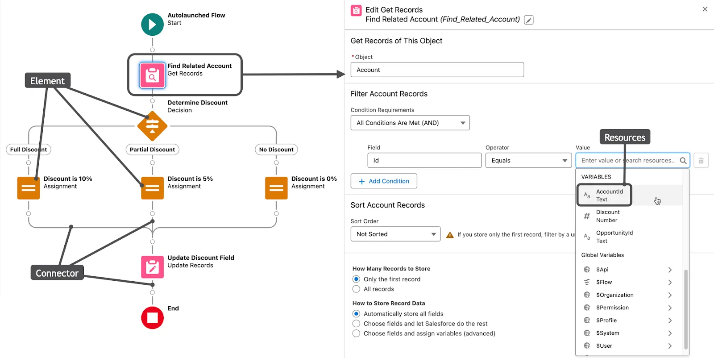

# Flow
An automation configuration saved in Salesforce with the structure of a flowchart. The flow automates a business process by collecting data and using that data to make things happen. It can affect things in your Salesforce org and in an external system.

# Flow Builder
The point-and-click primary tool for creating flows.

# Interactive Experiences
If your business process requires input from a user, you can use one of the following features.

- imp**Screen Flows**: Use Flow Builder to create an interaction that presents info and asks your users questions.
- imp**Autolaunched Flows**: Use Flow Builder to create automation that runs when requested in an Einstein AI conversation or when a button is clicked. These flows can also be run by other automations.
- **Approval Processes**: Build a series of steps with assigned approvers. Those steps can automate tasks such as locking and updating records. An approval process can run manually, when a button is clicked, or automatically, when it's launched by another automation.
- **Lightning Components**: Use HTML and JavaScript code to build an interactive component that you can embed in a page or an app.
- **Visualforce Pages**: Use HTML and Apex code to build an interactive page.

# Behind-the-Scenes Automation
If your business process should start automatically and run behind the scenes, such as when a record changes, you have several solutions to choose from.

- imp**Record-Triggered Flows**: Use Flow Builder to create automation that runs when a record is created, edited, or deleted.
- **Schedule-Triggered Flows**: Use Flow Builder to create automation that runs at a time and frequency you specify.
- **Platform Event-Triggered Flows**: Use Flow Builder to create automation that runs when a platform event message is received.
- **Data Cloud-Triggered Flow**: Use Flow Builder to create automation that runs when a change is made to data in Data Cloud.
- **Apex**: Use Apex code to write reusable blocks of automation. You can trigger this code in a variety of ways.

# When to use which Flow?
|**Requirement**|**Element Type to Use**|
|---------------|-----------------------|
|Collect information from user (contact’s first name, last name, and account) and ask what to do if a matching contact exists.|Interaction (Screen)|
|Look for a matching contact record.|Data (Get Records)|
|Check if a matching record was found and follow the corresponding path:|Logic (Decision)|
|If no match exists, create the contact.|Data (Create Records)|
|If a match exists, update that contact.|Data (Update Records)|
|Rejoin the branches together and then confirm what the flow did in Chatter.|Interaction (Action)|
|Confirm that the flow is done.|Interaction (Screen)|

# Flow Builder UI
**Toolbox (1)** 
The toolbox lists the elements and resources you’ve built in your flow. You can also create resources such as variables, formulas, and choices to use in your flow.

**Canvas (2)** 
The canvas is the working area, where you build a flow by adding elements. Adding elements to the canvas creates a visual diagram of the flow. 

**Button Bar (3)** 
The button bar provides information about the flow, such as:

- Whether the flow is active or not
- How long ago the flow was saved
- Whether the flow has any warnings or errors 

The button bar also includes two buttons for running a flow: *Run and Debug*.

*Run* runs the most recent saved version of the flow that you have open. If you have unsaved changes, they aren’t included in the run.
*Debug* lets you test the most recent saved version of the flow by feeding it sample data and reviewing what it does when it runs, so you can verify that the flow is doing what you want it to do. 
 

- **Elements (1)** are nodes on the canvas that make things happen. To add an element to the canvas, hover over Add Element and click Add element.
- **Connectors (2)** are lines on the canvas that define the path the flow takes when it runs. They tell the flow which element to execute next.
- **Resources (3)** are containers that don’t appear on the canvas, but are referenced by the flow’s elements. Each resource contains a value or a formula that resolves to a value. For example, your flow can search for an account’s ID, store that ID in a variable, and later use that variable to tell the flow which account to update.

# Elements
Each element is a step that tells the flow what to do, and each type of element does something different. Think of flow elements as three types.

|**Element Type**|**What It Does**|
|----------------|----------------|
|Interaction|Interacts with users|
|Data|Interacts with data|
|Logic|Interacts with the flow itself|

# Interaction Elements
- The *Screen element* can display data to users or collect information from them. You can display text or images, ask users to enter text, have users make a choice from radio buttons or a dropdown, and more. You can even use a Screen element to ask users to upload a file.
- The *Action element* can do many things, but most notably, it allows your flow to reach out to your users, associates, customers, and even external systems. This element can create Chatter posts, send emails, submit records for approval, send mobile notifications, and push outbound messages. And if you need your flow to do more, you can have a developer build custom actions in Apex.
- The *Subflow element* lets you call an autolaunched flow from another flow. Instead of interacting with users, it interacts with other flows. 
 
# Data Elements
The flow elements in the Data category: Create Records, Update Records, Get Records, and Delete Records.
 
Data elements instruct the flow to interact with records in the Salesforce database. Use data elements to look up, create, update, and delete Salesforce records. You can work with one record at a time, or many records all at once.

# Logic Elements
The flow elements in the Logic category: Assignment, Decision, Loop, Collection Sort, and Collection Filter.
 
After you collect the data you need, what do you want to do with it? With logic elements, you can evaluate that data and manipulate it according to your business requirements. You can:

- Create multiple paths that the flow can take, and define criteria for when the flow takes each path.
- Update temporary data so you can use it later in the flow.
- Create a looping path to work with groups of data.
- Pause the flow until a specified time.
- Change the contents or order of a collection of data.
Logic operates only in the flow. If you use logic elements to change data in your flow, the resulting data is accessible only until the flow finishes running. To store data outside the flow and access it after the flow runs, you use a data element or an action that sends the data to an external system.

# Connectors
Connectors define the path that the flow takes as it runs. They tell the flow which element to execute next. There are different types of connectors that tell the flow to take a different path in certain circumstances, but most of the time, the flow follows its connectors from one element to the next. 

# Flow Resources
Resources are containers that you reference throughout your flow. You can create resources as needed, but many elements create them for you. Each resource can store a single value, a formula, a formatted block of text, a whole record with all of its values, or even a collection of records.

# What is a variable in Flow?
A variable is a placeholder that is used when a value can change on certain conditions.
# Constants
A constant is like a variable, except that its value can’t change. That’s why it’s called a constant! When you create a constant, you set its value and the flow can’t change it.
# Formulas
Flow formulas are very similar to custom formula fields; the structure, format, and the way they use data is nearly identical. You can use most of the formula functions that you use in formula fields, and you can use variables and screen components as merge fields. The formatting for merge fields is different, however, so use the resource picker to make sure they’re added correctly.
# Text Templates
Sometimes you need to store a larger block of text, or maybe you need that text to be formatted in a specific way. Text Templates are basically constants that can store a large amount of rich text (text that has fonts, sizes, colors, lists, or other special formatting). Use a text template to store the body of an email or a chunk of formatted text to reuse on multiple screens. Like formulas, text templates can also use variables and screen components as merge fields.
