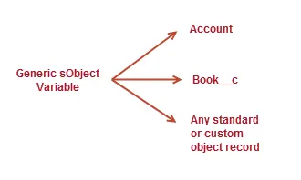

# What is Apex?
Apex is a programming language that uses Java-like syntax and acts like database stored procedures. Apex enables developers to add business logic to system events, such as button clicks, updates of related records, and Visualforce pages.

**Apex is**:
- Hosted
- Object oriented 
- Strongly typed
- Mutitenant aware
- Integrated with the database
- Data focused
- Easy to use & test
- Versioned

**Language constructs that Apex supports**:
- Classes, interfaces, properties, and collections (lists, maps, and sets).
- Object and array notation.
- Expressions, variables, and constants.
- Conditional statements (if-then-else) and control flow statements (for loops and while loops).
- Cloud development as Apex is stored, compiled, and executed in the cloud.
- Triggers, which are similar to triggers in database systems.
- Database statements that allow you to make direct database calls and query languages to query and search data.
- Transactions and rollbacks.
- The global access modifier, which is more permissive than the public modifier and allows access across namespaces and applications.
- Versioning of custom code.
*Apex is case sensitive language.*

# Data Types
1. **Primitive**
- Integer, 
- Double, 
- Long, 
- Date, 
- Datetime, 
- String, 
- ID, 
- Boolean
2. **sObject**
3. **Collection**
- Lists,
- Sets,
- Maps
4. **Enum**

# Apex Collections: List
Lists hold an ordered collection of data of the same type.<br>
```List<String> colors = new List<String>();```

**Adding elements in a List:**

```
// Create a list and add elements to it in one step
List<String> colors = new List<String> { 'red', 'green', 'blue' };
// Add elements to a list after it has been created
List<String> moreColors = new List<String>();
moreColors.add('orange');
moreColors.add('purple');
```

**Iteration over a List:**
```
// Get elements from a list
String color1 = moreColors.get(0);
String color2 = moreColors[0];
System.assertEquals(color1, color2);
// Iterate over a list to read elements
System.debug('Print out the colors in moreColors:');
for(String color : moreColors) {
    // Write value to the debug log
    System.debug(color);
}
```

# Apex Classes
One of the benefits of Apex classes is code reuse. Class methods can be called by triggers and other classes.

# Get started with Apex Trailhead
```
public class StringListTest {
        public static List<String> generateStringList(Integer n) {
        List<String> TestList = new List<String>();
        for(Integer i=0;i<n;i++) {
            TestList.add('Test ' + i);
            System.debug(TestList[i]);
        }
    return TestList;
    }
}
```

# sObject
Each Salesforce record is represented as an sObject before it is inserted into Salesforce. Likewise, when persisted records are retrieved from Salesforce, they’re stored in an sObject variable.

Standard and custom object records in Salesforce map to their sObject types in Apex. Here are some common sObject type names in Apex used for standard objects.

- Account
- Contact
- Lead
- Opportunity

# Create sObject Variables

To create an sObject, you need to declare a variable and assign an sObject instance to it. The data type of the variable is the sObject type.<br>
```Account acct = new Account(Name='Acme');```

# Create sObjects and Adding Fields

Before you can insert a Salesforce record, you must create it in memory first as an sObject. Like with any other object, sObjects are created with the `new` operator:<br>

```Account acct = new Account();```<br>

The fastest way to add fields is to specify them as name-value pairs inside the constructor. For example, this statement creates a new account sObject and populates its Name field with a string value.<br>
```Account acct = new Account(Name='Acme', Phone='(415)555-1212', NumberOfEmployees=100);```<br>
```
Account acct = new Account();
acct.Name = 'Acme';
acct.Phone = '(415)555-1212';
acct.NumberOfEmployees = 100;
```

# Work with the Generic sObject Data Type
Typically, you use the specific sObject data type, such as Account for a standard object or Book__c for a custom object called Book, when working with sObjects. However, when you don’t know the type of sObject your method is handling, you can use the generic sObject data type.
Variables that are declared with the generic sObject data type can reference any Salesforce record, whether it is a standard or custom object record.<br>
<br>
This example shows how any Salesforce object, such as an account or a custom object called Book__c, can be assigned to a generic sObject variable.<br>
```
sObject sobj1 = new Account(Name='Trailhead');
sObject sobj2 = new Book__c(Name='Workbook 1');
```


# Cast Generic sObjects to Specific sObject Types

When you’re dealing with generic sObjects, you sometimes need to cast your sObject variable to a specific sObject type. One of the benefits of doing so is to be able to access fields using dot notation, which is not available on the generic sObject. Since sObject is a parent type for all specific sObject types, you can cast a generic sObject to a specific sObject. This example shows how to cast a generic sObject to Account.<br>
```
// Cast a generic sObject to an Account
Account acct = (Account)myGenericSObject;
// Now, you can use the dot notation to access fields on Account
String name = acct.Name;
String phone = acct.Phone;
```

# Manipulate Records with DML
Create and modify records in Salesforce by using the Data Manipulation Language, abbreviated as DML. DML provides a straightforward way to manage records by providing simple statements to insert, update, merge, delete, and restore records.

Because Apex is a data-focused language and is saved on the Lightning Platform, it has direct access to your data in Salesforce. Unlike other programming languages that require additional setup to connect to data sources, with Apex DML, managing records is made easy! By calling DML statements, you can quickly perform operations on your Salesforce records. This example adds the Acme account to Salesforce. An account sObject is created first and then passed as an argument to the insert statement, which persists the record in Salesforce.<br>

```// Create the account sObject 
Account acct = new Account(Name='Acme', Phone='(415)555-1212', NumberOfEmployees=100);
// Insert the account by using DML
insert acct;
```

# DML Statements

- `insert`
- `update`
- `upsert`(update + insert)
- `delete`
- `undelete`
- `merge`

Each DML statement accepts either a single sObject or a list (or array) of sObjects. Operating on a list of sObjects is a more efficient way for processing records.

All those statements, except a couple, are familiar database operations. The `upsert` and `merge` statements are particular to Salesforce and can be quite handy.

- The `upsert` DML operation creates new records and updates sObject records within a single statement, using a specified field to determine the presence of existing objects, or the ID field if no field is specified.

- The `merge` statement merges up to three records of the same sObject type into one of the records, deleting the others, and re-parenting any related records.

# ID Field Auto-Assigned to New Records

When inserting records, the system assigns an ID for each record. In addition to persisting the ID value in the database, the ID value is also auto-populated on the sObject variable that you used as an argument in the DML call.

This example shows how to get the ID on the sObject that corresponds to the inserted account.
```
// Create the account sObject 
Account acct = new Account(Name='Acme', Phone='(415)555-1212', NumberOfEmployees=100);
// Insert the account by using DML
insert acct;
// Get the new ID on the inserted sObject argument
ID acctID = acct.Id;
// Display this ID in the debug log
System.debug('ID = ' + acctID);
// Debug log result (the ID will be different in your case)
// DEBUG|ID = 001D000000JmKkeIAF
Note
Beyond the Basics
```

# Bulk DML

You can perform DML operations either on a single sObject, or in bulk on a list of sObjects. Performing bulk DML operations is the recommended way because it helps avoid hitting governor limits, such as the DML limit of 150 statements per Apex transaction. This limit is in place to ensure fair access to shared resources in the Lightning Platform. Performing a DML operation on a list of sObjects counts as one DML statement, not as one statement for each sObject.

**Upsert Records**<br>

If you have a list containing a mix of new and existing records, you can process insertions and updates to all records in the list by using the upsert statement. Upsert helps avoid the creation of duplicate records and can save you time as you don’t have to determine which records exist first.

The upsert statement matches the sObjects with existing records by comparing values of one field. If you don’t specify a field when calling this statement, the upsert statement uses the sObject’s ID to match the sObject with existing records in Salesforce. Alternatively, you can specify a field to use for matching. For custom objects, specify a custom field marked as external ID. For standard objects, you can specify any field that has the idLookup property set to true. For example, the Email field of Contact or User has the idLookup property set.
Syntax:<br>
`upsert sObject | sObject[]`

`upsert sObject | sObject[] field`<br>

Upsert uses the sObject record's primary key (the ID), an idLookup field, or an external ID field to determine whether it should create a new record or update an existing one:

- If the key is not matched, a new object record is created.
- If the key is matched once, the existing object record is updated.
- If the key is matched multiple times, an error is generated and the object record is neither inserted or updated.

**Delete Records**

You can delete persisted records using the delete statement. Deleted records aren’t deleted permanently from Lightning Platform, but they’re placed in the Recycle Bin for 15 days from where they can be restored.<br>
```
Contact[] contactsDel = [SELECT Id FROM Contact WHERE LastName='Smith']; 
delete contactsDel;
```
**DML Statement Exceptions**<br>

If a DML operation fails, it returns an exception of type DmlException. You can catch exceptions in your code to handle error conditions.

This example produces a DmlException because it attempts to insert an account without the required Name field. The exception is caught in the catch block.
```
try {
    // This causes an exception because 
    //   the required Name field is not provided.
    Account acct = new Account();
    // Insert the account 
    insert acct;
} catch (DmlException e) {
    System.debug('A DML exception has occurred: ' +
                e.getMessage());
}
```

# Database Methods
Apex contains the built-in Database class, which provides methods that perform DML operations and mirror the DML statement counterparts.
These Database methods are static and are called on the class name.

- `Database.insert()`
- `Database.update()`
- `Database.upsert()`
- `Database.delete()`
- `Database.undelete()`
- `Database.merge()`<br>
Unlike DML statements, Database methods have an optional allOrNone parameter that allows you to specify whether the operation should partially succeed. When this parameter is set to false, if errors occur on a partial set of records, the successful records will be committed and errors will be returned for the failed records. Also, no exceptions are thrown with the partial success option.

**Insert**<br>
```Database.insert(recordList, false);```<br>
**Save**<br>
```Database.SaveResult[] results = Database.insert(recordList, false);```<br>
By default, the allOrNone parameter is true, which means that the Database method behaves like its DML statement counterpart and will throw an exception if a failure is encountered.
The following two statements are equivalent to the insert recordList; statement.

```Database.insert(recordList);```<br>
And:<br>
```Database.insert(recordList, true);```<br>

**Should You Use DML Statements or Database Methods?**

Use DML statements if you want any error that occurs during bulk DML processing to be thrown as an Apex exception that immediately interrupts control flow (by using try. . .catch blocks). This behavior is similar to the way exceptions are handled in most database procedural languages.
Use Database class methods if you want to allow partial success of a bulk DML operation—if a record fails, the remainder of the DML operation can still succeed. Your application can then inspect the rejected records and possibly retry the operation. When using this form, you can write code that never throws DML exception errors. Instead, your code can use the appropriate results array to judge success or failure. Note that Database methods also include a syntax that supports thrown exceptions, similar to DML statements.

# Work with Related Records
Create and manage records that are related to each other through relationships.

**Insert Related Records**<br>

You can insert records related to existing records if a relationship has already been defined between the two objects, such as a lookup or master-detail relationship. A record is associated with a related record through a foreign key ID. For example, if inserting a new contact, you can specify the contact's related account record by setting the value of the `AccountId` field.<br>

**Update Related Records**<br>

Fields on related records can't be updated with the same call to the DML operation and require a separate DML call. For example, if inserting a new contact, you can specify the contact's related account record by setting the value of the `AccountId` field. However, you can't change the account's name without updating the account itself with a separate DML call. Similarly, when updating a contact, if you also want to update the contact’s related account, you must make two DML calls. <br>

**Delete Related Records**<br>

The delete operation supports cascading deletions. If you delete a parent object, you delete its children automatically, as long as each child record can be deleted.<br>

**About Transactions**<br>

DML operations execute within a transaction. All DML operations in a transaction either complete successfully, or if an error occurs in one operation, the entire transaction is rolled back and no data is committed to the database. The boundary of a transaction can be a trigger, a class method, an anonymous block of code, an Apex page, or a custom Web service method. For example, if a trigger or class creates two accounts and updates one contact, and the contact update fails because of a validation rule failure, the entire transaction rolls back and none of the accounts are persisted in Salesforce.